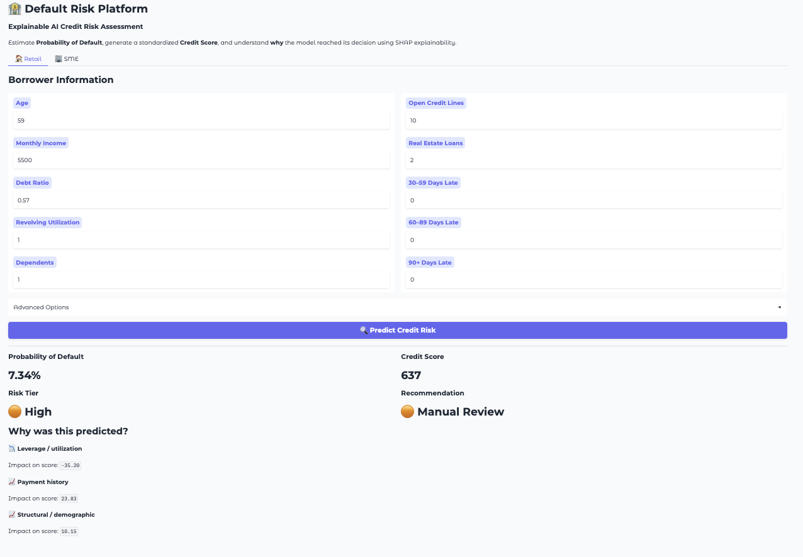
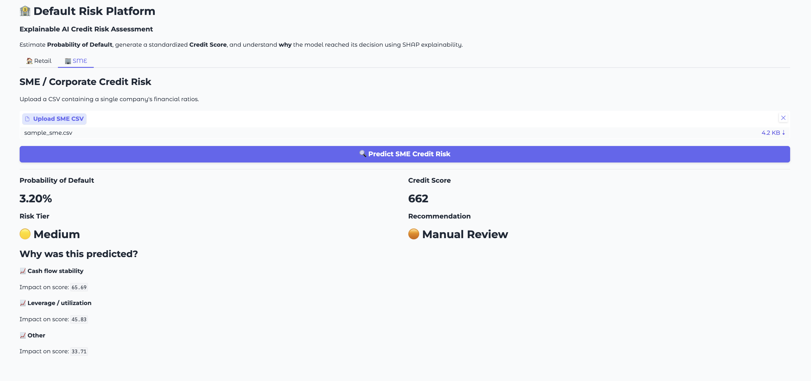

---

# 🏦 Default Risk Platform

> **An Explainable AI Platform for Probability of Default (PD) Prediction and Credit Risk Assessment**

[Live Demo](#) • [Project Report](#)

---

## 📌 Overview

Default Risk Platform is an end-to-end proof of concept that predicts the **Probability of Default (PD)** for both **Retail** and **SME** borrowers using explainable machine learning.

Unlike a traditional ML notebook, this project delivers a deployable web application capable of:

* Predicting borrower default probability
* Converting probabilities into standardized credit scores
* Classifying borrowers into risk tiers
* Generating business recommendations
* Explaining every prediction using SHAP

The platform demonstrates a reusable architecture that can evolve into a production-ready MSME credit intelligence system.

---

# 📷 Application Preview

## Retail Credit Risk Assessment

```markdown

```

---

## SME Credit Risk Assessment

```markdown

```

---

# ✨ Features

### Retail Borrower Assessment

* Manual borrower information entry
* Probability of Default prediction
* Credit Score generation
* Risk Tier classification
* Business recommendation engine
* SHAP explainability

### SME Credit Risk Assessment

* Upload company financial ratios (CSV)
* Bankruptcy probability prediction
* Credit Score generation
* Risk Tier classification
* Business recommendation engine
* SHAP explainability

---

# 🏗 Architecture

```text
                    User
                      │
          ┌───────────┴────────────┐
          │                        │
     Retail Form            SME CSV Upload
          │                        │
          └───────────┬────────────┘
                      │
              Prediction Engine
                      │
      ┌───────────────┼────────────────┐
      │               │                │
  XGBoost      Isotonic Calibration   Scorecard
      │               │                │
      └───────────────┼────────────────┘
                      │
         Probability of Default (PD)
                      │
      ┌───────────────┼────────────────┐
      │               │                │
 Credit Score     SHAP Explainability Recommendation
                      │
                  Gradio UI
```

---

# 🧠 Machine Learning Pipeline

* Data preprocessing
* Missing value handling
* Logistic Regression baseline
* XGBoost training
* Probability calibration (Isotonic Regression)
* Credit score generation
* SHAP explainability
* Business recommendation

---

# 📊 Datasets

## Retail

**Give Me Some Credit (Kaggle)**

Consumer credit dataset containing borrower financial information including:

* Revolving utilization
* Monthly income
* Debt ratio
* Payment history
* Credit lines
* Dependents

---

## SME

**Company Bankruptcy Prediction (Taiwan Economic Journal)**

Corporate financial dataset containing approximately 95 financial indicators including:

* Liquidity ratios
* Profitability ratios
* Cash flow metrics
* Solvency ratios
* Asset turnover
* Leverage indicators

Used as a proxy for SME credit risk prediction.

---

# 📈 Results

## Retail

| Model               |       AUC |      Gini |        KS |
| ------------------- | --------: | --------: | --------: |
| Logistic Regression |     0.800 |     0.601 |     0.447 |
| **XGBoost**         | **0.869** | **0.738** | **0.579** |

---

## SME

| Model               |       AUC |      Gini |        KS |
| ------------------- | --------: | --------: | --------: |
| Logistic Regression |     0.847 |     0.694 |     0.616 |
| **XGBoost**         | **0.954** | **0.908** | **0.798** |

---

# 🔍 Explainability

Every prediction is accompanied by SHAP-based explanations grouped into business-friendly reason codes.

Example:

* 📉 Leverage / Utilization
* 📈 Payment History
* 📈 Cash Flow Stability
* 📈 Structural / Demographic

This enables transparent and interpretable credit decisions.

---

# 🚀 Current PoC vs Production Vision

| Capability                              | Current PoC | Production Vision |
| --------------------------------------- | :---------: | :---------------: |
| Retail PD Prediction                    |      ✅      |         ✅         |
| SME PD Prediction                       |      ✅      |         ✅         |
| Credit Scorecard                        |      ✅      |         ✅         |
| SHAP Explainability                     |      ✅      |         ✅         |
| Business Recommendation                 |      ✅      |         ✅         |
| Structured Data                         |      ✅      |         ✅         |
| Document OCR                            |      ⏳      |         ✅         |
| Bank Statement Analysis                 |      ⏳      |         ✅         |
| Financial Statement Parsing             |      ⏳      |         ✅         |
| Institution-specific 12-month PD Models |      ⏳      |         ✅         |
| Portfolio Monitoring                    |      ⏳      |         ✅         |

---

# 🔮 Future Scope

The current application demonstrates the **core explainable prediction engine**.

Future enhancements include:

* 📄 OCR-based document ingestion
* 🏦 Bank statement parsing
* 📑 GST & financial statement extraction
* 🤖 AI-assisted underwriting
* 📊 Portfolio monitoring dashboard
* 📈 Continuous model retraining
* ☁ REST API deployment
* 🏢 Institution-specific MSME models trained for 12-month default prediction

```
Documents / APIs
        │
        ▼
 OCR + AI Extraction
        │
        ▼
 Structured Features
        │
        ▼
 Existing Prediction Engine
```

---

# 💻 Tech Stack

**Machine Learning**

* XGBoost
* Scikit-learn
* SHAP

**Backend**

* Python
* Pandas
* NumPy
* Joblib

**Frontend**

* Gradio

---

# 📂 Project Structure

```text
default-risk-platform/

├── app.py
├── engine.py
├── predictor.py
├── explainability.py
├── loaders.py
├── scoring.py
├── models/
├── samples/
├── tests/
├── README.md
└── requirements.txt
```

---

# ▶️ Running Locally

```bash
git clone https://github.com/deepakgrandhi/borrower_risk-analysis.git

cd borrower_risk-analysis

pip install -r requirements.txt

python app.py
```

---

# ⚠ Disclaimer

This project is a **proof of concept** built using publicly available benchmark datasets.

The platform validates an explainable Probability of Default pipeline and demonstrates how the same architecture can evolve into an enterprise-grade MSME credit risk system using institution-specific data and document intelligence.

---

# 👨‍💻 Author

**Deepak Grandhi**

---
